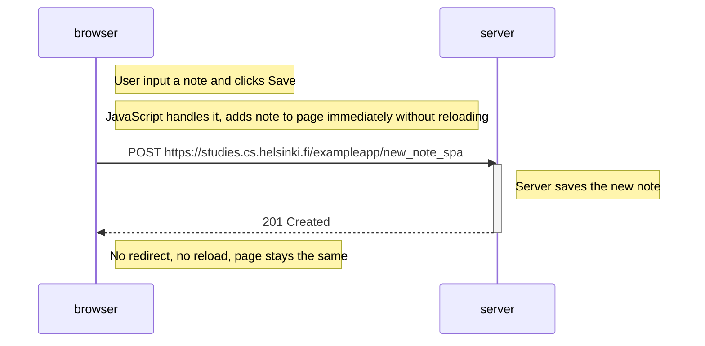

```mermaid
sequenceDiagram
    participant browser
    participant server

    Note right of browser: User input a note and clicks Save

    Note right of browser: JavaScript handles it, adds note to page immediately without reloading

    browser->>server: POST https://studies.cs.helsinki.fi/exampleapp/new_note_spa
    activate server

    Note right of server: Server saves the new note

    server-->>browser: 201 Created
    deactivate server

    Note right of browser: No redirect, no reload, page stays the same
```
